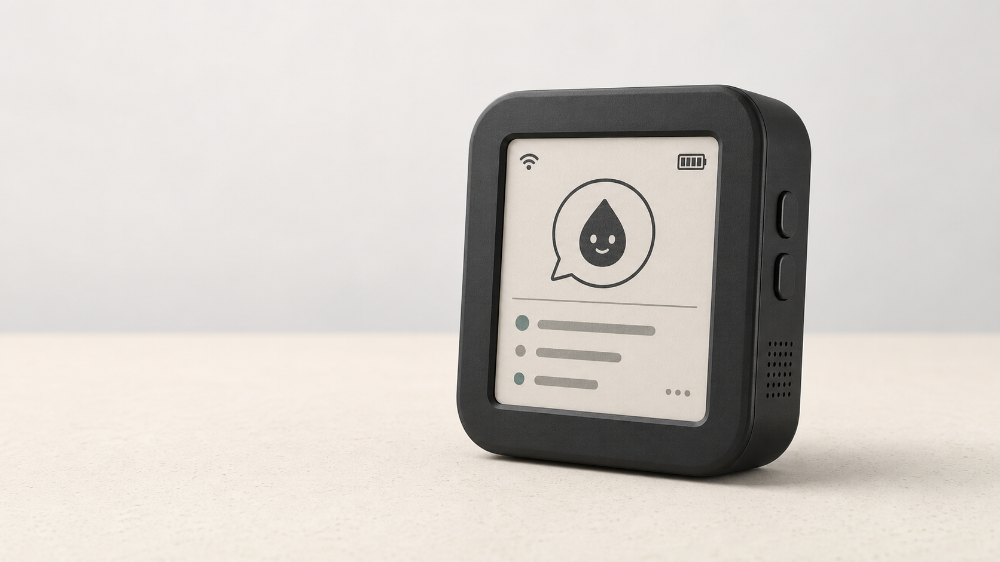

# InkMate

<p align="center">
  
</p>



**A persistent, local-first voice interface for AI and trusted tools.**

InkMate is a local-first AI desk companion for the battery-equipped, non-touch
Waveshare ESP32-S3 1.54-inch e-paper board. It records a question while the BOOT
button is held, sends the audio to a trusted-LAN gateway, and leaves a concise
answer on the 200 x 200 e-paper display. The gateway owns speech recognition,
AI providers, text-to-speech, and access to explicitly allowlisted tools.

> [!IMPORTANT]
> The board revision and memory must be detected on real hardware before
> flashing a release build. The expected configuration is V2 with 4 MB flash
> and 2 MB PSRAM, but V1/V2 pin maps exist. Some units may also fail to restart
> on battery after a software reset. OTA and automatic deep sleep stay disabled
> until the [reset matrix](docs/hardware-bring-up.md#battery-reset-matrix) passes.

## Repository layout

| Path | Purpose |
| --- | --- |
| `firmware/` | ESP-IDF C++ device firmware and board profiles |
| `gateway/` | FastAPI gateway and local/cloud provider adapters |
| `protocol/` | Versioned schemas shared by firmware and gateway |
| `config/` | Sanitized configuration examples |
| `docs/` | Architecture, bring-up, protocol, and extension guides |
| `scripts/` | Build, test, and hardware inspection helpers |

Clone with submodules so the shared local tooling is available:

```sh
git clone --recurse-submodules https://github.com/nikolareljin/ink-mate.git
```

## Quick start

### Local commands

The root command suite uses the `scripts/script-helpers` submodule for shared
logging, Python, and Docker behavior. Each command accepts `--help`.

```sh
./update                         # initialize/update pinned submodules
./install                        # ESP-IDF, gateway test, and docs dependencies
./build                          # firmware (V1 and V2), gateway image, and docs
./test                           # gateway, firmware, and documentation checks
./deploy --profile v2 --port /dev/ttyACM0 --hardware-verified
```

`./install --with-docker` explicitly opts into system Docker installation. Use
`./install --with-audio` to add optional local STT dependencies. The default
installation paths are ignored by Git; see each command's `--help` for
component-selection and path options.

### Gateway

1. Copy `.env.example` to `.env` and replace every placeholder.
2. Start the local stack:

   ```sh
   docker compose up --build
   ```

The default Compose configuration binds the gateway to `127.0.0.1:8080`. To
use it from the device, set `INKMATE_BIND_ADDRESS` to a trusted LAN interface;
do not expose it directly to the internet.

### Hardware and firmware

1. Connect the board over USB. To install the pinned ESP-IDF toolchain locally
   and inspect the connected board in one command, run:

   ```sh
   ./scripts/inspect-connected-device.sh /dev/ttyACM0
   ```

   The toolchain is installed under `.tools/esp-idf` (ignored by Git). Set
   `INKMATE_ESP_IDF_DIR` to use an existing installation instead.
2. Save the result locally, then compare the PCB silkscreen and detected memory with
   [the bring-up guide](docs/hardware-bring-up.md).
3. Build an explicit profile, for example:

   ```sh
   ./scripts/build-firmware.sh v2
   ./scripts/flash-firmware.sh v2 /dev/ttyACM0
   ```

Never guess the board profile. The flash helper requires an explicit profile
and a second acknowledgement if battery-reset validation is incomplete. Before
every write it creates a full, timestamped flash dump under
`firmware/backups/` and records its SHA-256 checksum. Backups may contain
stored Wi-Fi credentials, remain local-only, and are ignored by Git. Use
`./scripts/backup-flash.sh v2 /dev/ttyACM0` to make a backup without flashing.

## Intended controls

- Hold BOOT to record; release it to submit.
- Press BOOT briefly while idle to cycle cards.
- When an action is pending, press BOOT briefly to confirm or hold it to cancel.
- PWR remains dedicated to the board's power latch and shutdown behavior.

Host mutations are proposals first. Only fixed command templates are eligible,
and a valid physical confirmation is required before execution.
## Documentation

The published documentation site is available at
[nikolareljin.github.io/ink-mate](https://nikolareljin.github.io/ink-mate/).

- [Hardware capabilities and known unknowns](docs/hardware.md)
- [Hardware identification and bring-up](docs/hardware-bring-up.md)
- [System architecture and data flow](docs/architecture.md)
- [Firmware design and device states](docs/firmware.md)
- [Gateway deployment and providers](docs/deployment.md)
- [Wire protocol and authentication](docs/protocol.md)
- [Security model and threat analysis](docs/security-model.md)
- [Extension and adapter development](docs/extensions.md)
- [Development workflow and testing](docs/development.md)
- [Troubleshooting and recovery](docs/troubleshooting.md)
- [Roadmap and implementation plan](docs/roadmap.md)
- [Hardware and software sources](docs/sources.md)
- [Brand and application assets](docs/branding.md)

The documentation distinguishes verified listing facts, vendor claims,
implementation defaults, and properties that still require measurement on the
physical board.


## Development

Run the checks supported by the current checkout with `./scripts/check.sh`.
See [CONTRIBUTING.md](CONTRIBUTING.md) before sending changes. The protocol and
security boundaries are described in [docs/protocol.md](docs/protocol.md) and
[docs/architecture.md](docs/architecture.md).

## License

InkMate is licensed under the [MIT License](LICENSE). Third-party board and
driver code must retain its original notices and be recorded in attribution
documentation before it is vendored.
