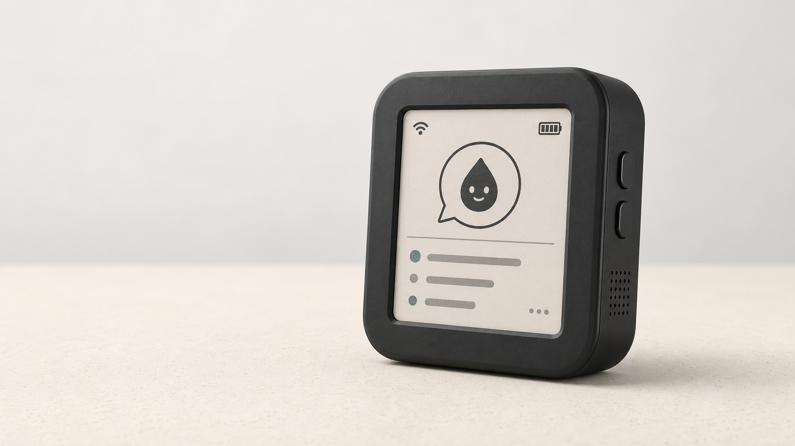
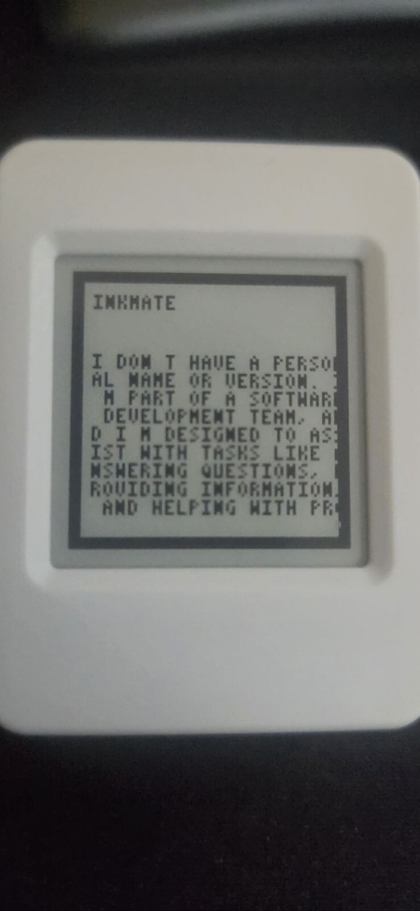
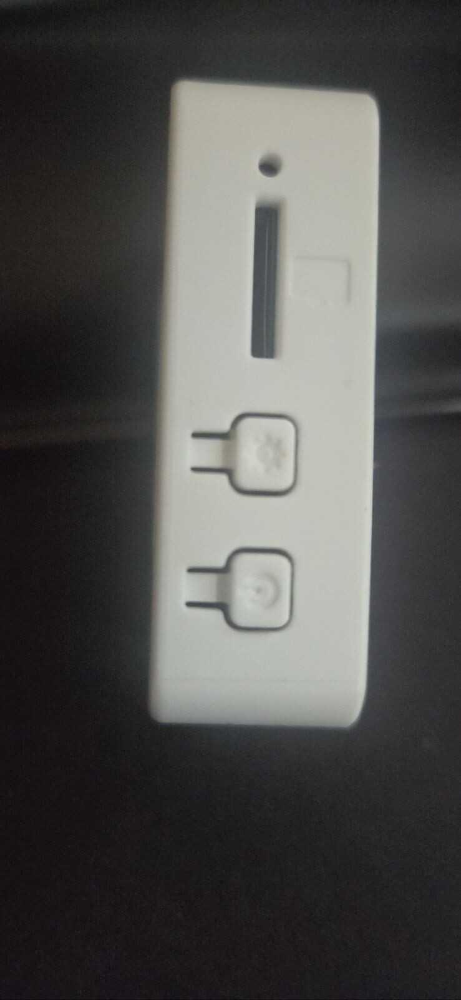

# InkMate

<p align="center">
  
</p>



**A quiet, local-first e-paper companion.**

InkMate is for small moments when a phone or computer would be too much. Hold
BOOT, speak, and release it. A nearby service turns that into a short response
that stays on the 200 x 200 e-paper display, even after power is removed.

The project keeps the device simple: it records audio, shows cards, and plays
short replies. The trusted local service handles speech, response generation,
and any carefully approved integrations.

## On the device

<p align="center">
  
  
</p>

The device retains a returned response card on the display. Its side controls
provide BOOT and PWR input.

## Supported hardware

InkMate is built for the battery-equipped, non-touch
[Waveshare ESP32-S3 1.54-inch e-paper board](https://www.aliexpress.us/item/3256810104401869.html).

- The tested device is the V2 battery-equipped, non-touch board with an
  ESP32-S3-PICO-1-N8R8, 8 MB flash, and 8 MB PSRAM.
- V1 and V2 non-touch profiles are available, but every board must be inspected
  before flashing. A profile is not evidence that a particular board matches it.
- Touch variants and unverified revisions are not supported.

See the [hardware guide](docs/hardware.md) for the evidence behind these
statements and the [bring-up guide](docs/hardware-bring-up.md) before flashing.

## Made for a private, useful place

Use InkMate to glance at home-automation status, control an approved local home
assistant, dictate a note, keep an organizer card, or ask a short question from
a desk or shelf. It is designed around a service you choose on your own network,
not a third party listening to or monitoring your day.

## Connect local services

The optional adapter host connects InkMate to services already running on the
host computer. It accepts only loopback HTTP endpoints or fixed local commands.
Each connection is discovered, inspected, approved, and granted to a specific
device. Read-only operations return cards; changes require physical confirmation
on InkMate. See the [extension guide](docs/extensions.md) for the current
manifest, approval, and invocation interface.

> [!IMPORTANT]
> The board revision and memory must be detected on real hardware before
> flashing a release build. V2 uses the ESP32-S3-PICO-1-N8R8 with 8 MB flash
> and 8 MB PSRAM; V1/V2 pin maps are not interchangeable. Some units may also fail to restart
> on battery after a software reset. OTA and automatic deep sleep stay disabled
> until the [reset matrix](docs/hardware-bring-up.md#battery-reset-matrix) passes.

## Repository layout

| Path | Purpose |
| --- | --- |
| `firmware/` | ESP-IDF C++ device firmware and board profiles |
| `gateway/` | FastAPI gateway and local/cloud provider adapters |
| `protocol/` | Versioned schemas shared by firmware and gateway |
| `config/` | Sanitized configuration examples |
| `docs/` | Architecture, bring-up, protocol, and extension guides |
| `scripts/` | Build, test, and hardware inspection helpers |

Clone with submodules so the shared local tooling is available:

```sh
git clone --recurse-submodules https://github.com/nikolareljin/ink-mate.git
```

## Quick start

### Local commands

The root command suite uses the `scripts/script-helpers` submodule for shared
logging, Python, and Docker behavior. Each command accepts `--help`.

```sh
./update                         # initialize/update pinned submodules
./install                        # ESP-IDF, gateway test, and docs dependencies
./build                          # firmware (V1 and V2), gateway image, and docs
./test                           # gateway, firmware, and documentation checks
./deploy --profile v2 --port /dev/ttyACM0 --hardware-verified
./scripts/verify-connected-device.sh v2 /dev/ttyACM0
./dev run gateway                  # starts the trusted-LAN gateway in Docker
./dev stop                         # stops the gateway without removing its data
./dev run adapter-host             # optional loopback-only local adapter host
./dev adapters list                # inspect discovered and approved adapters
```

`./install --with-docker` explicitly opts into system Docker installation. Use
`./install --with-audio` to add optional local STT dependencies. The default
installation paths are ignored by Git; see each command's `--help` for
component-selection and path options.

### Gateway

1. Copy `.env.example` to `.env` and replace every placeholder.
2. Start the local stack:

   ```sh
   docker compose up --build
   ```

The default Compose configuration binds the gateway to `127.0.0.1:8080`. To
use it from the device, set `INKMATE_BIND_ADDRESS` to a trusted LAN interface;
do not expose it directly to the internet.

### Hardware and firmware

1. Connect the board over USB. To install the pinned ESP-IDF toolchain locally
   and inspect the connected board in one command, run:

   ```sh
   ./scripts/inspect-connected-device.sh /dev/ttyACM0
   ```

   The toolchain is installed under `.tools/esp-idf` (ignored by Git). Set
   `INKMATE_ESP_IDF_DIR` to use an existing installation instead.
2. Save the result locally, then compare the PCB silkscreen and detected memory with
   [the bring-up guide](docs/hardware-bring-up.md).
3. Build an explicit profile, for example:

   ```sh
   ./scripts/build-firmware.sh v2
   ./scripts/flash-firmware.sh v2 /dev/ttyACM0
   ```

Never guess the board profile. The flash helper requires an explicit profile
and a second acknowledgement if battery-reset validation is incomplete. Before
every write it creates a full, timestamped flash dump under
`firmware/backups/` and records its SHA-256 checksum. Backups may contain
stored Wi-Fi credentials, remain local-only, and are ignored by Git. Use
`./scripts/backup-flash.sh v2 /dev/ttyACM0` to make a backup without flashing.

After a flash, verify the exact bootloader, partition table, and application
bytes with:

```sh
./scripts/verify-flash.sh v2 /dev/ttyACM0
```

The verifier resets the board and excludes OTA metadata because the bootloader
updates it when selecting the active slot. Capture a filtered boot report with:

```sh
./scripts/capture-boot-log.sh /dev/ttyACM0
```

The report is saved under ignored `hardware-reports/` and excludes lines that
may contain credentials or device identifiers. `verify-connected-device.sh`
chains the hardware probe, byte verification, and boot-log capture.

Verify BOOT gestures after the V2 firmware is installed:

```sh
./scripts/verify-controls.sh /dev/ttyACM0
```

## Controls

- Hold BOOT for 700 ms to begin recording; release it to submit.
- Press BOOT for less than 700 ms while idle to cycle cards.
- When an action is pending, press BOOT briefly to confirm or hold it to cancel.
- Hold PWR for 2 seconds to release the battery power latch. USB can keep the board powered.

Changes to a connected local application are always shown on the device first.
Only fixed command templates are eligible, and BOOT confirmation is required
before anything runs.
## Documentation

The published documentation site is available at
[nikolareljin.github.io/ink-mate](https://nikolareljin.github.io/ink-mate/).

- [Hardware capabilities and known unknowns](docs/hardware.md)
- [Hardware identification and bring-up](docs/hardware-bring-up.md)
- [System architecture and data flow](docs/architecture.md)
- [Firmware design and device states](docs/firmware.md)
- [Gateway deployment and providers](docs/deployment.md)
- [Wire protocol and authentication](docs/protocol.md)
- [Security model and threat analysis](docs/security-model.md)
- [Extension and adapter development](docs/extensions.md)
- [Development workflow and testing](docs/development.md)
- [Troubleshooting and recovery](docs/troubleshooting.md)
- [Roadmap and implementation plan](docs/roadmap.md)
- [Hardware and software sources](docs/sources.md)

The documentation separates verified observations, vendor claims, and things
that still need to be measured on a physical board.


## Development

Run the checks supported by the current checkout with `./scripts/check.sh`.
See [CONTRIBUTING.md](CONTRIBUTING.md) before sending changes. The protocol and
security boundaries are described in [docs/protocol.md](docs/protocol.md) and
[docs/architecture.md](docs/architecture.md).

## License

InkMate is licensed under the [MIT License](LICENSE). Third-party board and
driver code must retain its original notices and be recorded in attribution
documentation before it is vendored.

---

## Clone traffic


_Updated daily. Total and unique cloners over the last 14 days._
