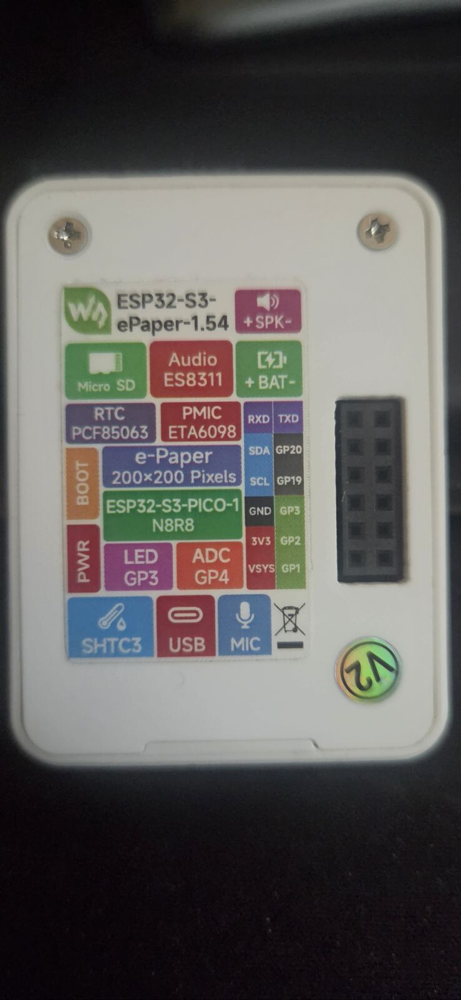

# Hardware

InkMate currently targets the battery-equipped, non-touch option of the
[Waveshare ESP32-S3 1.54-inch e-paper board](https://www.aliexpress.us/item/3256810104401869.html).
The selected option is `With Bat No Touch`. The product family includes touch
variants, so a marketplace title is not enough to identify the board in hand.

## Evidence labels

- **Listing fact:** directly present in the linked public product listing.
- **Vendor claim:** described by the seller/vendor but still requires validation.
- **Working assumption:** useful for development, not yet confirmed on the unit.
- **Unknown:** must remain disabled or unspecified until reliable evidence exists.

## What the listing describes

The listing describes an ESP32-S3, Wi-Fi and Bluetooth LE, a 1.54-inch 200 x
200 e-paper panel, audio, RTC, temperature/humidity sensor, microSD slot,
battery charging, BOOT and PWR buttons, and a 2 x 6 expansion header. Treat
these as useful starting points, not guarantees for every revision.

The ES8311 codec is a working assumption based on related board materials, not a fact established by the linked marketplace listing. Battery capacity, charging limits, battery ADC circuit, panel driver, and expansion pinout are unknown.

## Profiles and verified V2 memory

Vendor material distinguishes V1 and V2 non-touch boards. InkMate keeps those
profiles explicit because a store SKU does not establish a PCB revision. The
tested V2 board uses ESP32-S3-PICO-1-N8R8 with 8 MB flash and 8 MB PSRAM.
PCB markings, `esptool flash-id`, and ESP-IDF boot diagnostics take precedence.

## Observed V2 enclosure

<figure class="ink-device-photo" markdown>

  <figcaption>Rear enclosure label on the observed V2 device.</figcaption>
</figure>

The label helps identify the physical unit, but its specifications are vendor
markings. Use the USB probe and boot diagnostics before choosing a build
profile. Published copies of the device photos have camera metadata removed.

The V2 example confirms GPIO 6 for e-paper power, GPIOs 8-13 for panel control
and SPI, GPIO 17 for battery power hold, GPIO 0 for BOOT, GPIO 18 for PWR, and
GPIOs 47-48 for shared I2C. Both buttons are active-low. These values belong
only to the V2 profile. A different board needs its own profile and verified
pin map; do not copy pins from V1, V2, or a touch model.

## Limits to keep in mind

- E-paper is slow, monochrome, susceptible to ghosting, and unsuitable for animation, though it retains an image without power.
- Audio and Wi-Fi can dominate battery use despite low display standby power.
- One customer review reports that a no-touch battery unit could not restart on battery after reset and first needed USB. This is unverified and may not affect every unit, but it requires the reset matrix before OTA or unattended sleep/reboot.
- Battery state-of-charge must stay “unknown” until ADC calibration and a cell discharge curve exist.
- Touch support is outside the initial target.
