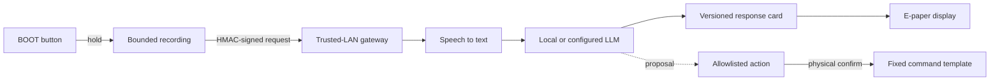

---
hide:
  - navigation
  - toc
---

<section class="ink-hero">
  

    
    
Quiet hardware. Useful intelligence.

    <h1>A persistent, local-first AI companion.</h1>
    
InkMate turns a tiny ESP32-S3 e-paper board into a calm voice interface for local AI and carefully allowlisted tools.

    

      <a class="md-button md-button--primary" href="hardware-bring-up/">Bring up the board</a>
      <a class="md-button" href="architecture/">Explore the architecture</a>
    

  

  
</section>

## What InkMate does

InkMate keeps the microcontroller deliberately small and understandable. The
device handles buttons, audio capture, networking, e-paper cards, and playback.
A trusted-LAN gateway handles speech recognition, model providers, synthesis,
and controlled automation. The screen retains the last useful card even when
power is removed.

  <article class="ink-card">01<h3>Ask naturally</h3>
Hold BOOT to record, then release to submit a bounded audio clip.
</article>
  <article class="ink-card">02<h3>Process locally</h3>
The signed request reaches your gateway, local speech model, and Ollama-compatible LLM.
</article>
  <article class="ink-card">03<h3>Keep the answer</h3>
A concise card remains visible on the 200 × 200 e-paper display without continuous refresh.
</article>
  <article class="ink-card">04<h3>Confirm actions</h3>
Mutating tools use fixed templates, short expiry, and an explicit physical confirmation.
</article>

## The logic, end to end

The wire contract is versioned and authenticated. Requests include device ID,
timestamp, body hash, and HMAC signature. Actions are proposals until the same
device confirms them before expiry. [Read the full architecture](architecture.md)
or inspect the [protocol schemas](protocol.md).

## What is inside

| Area | Responsibility | Start here |
| --- | --- | --- |
| Firmware | Board profiles, state machine, provisioning, recording and display boundaries | [Firmware guide](firmware.md) |
| Gateway | FastAPI authentication, provider adapters, cards, speech and safe actions | [Deployment guide](deployment.md) |
| Protocol | JSON Schemas and representative messages | [Protocol reference](protocol.md) |
| Hardware | Evidence ledger, pin profiles, memory limits and bring-up gates | [Hardware guide](hardware.md) |
| Tooling | Local checks via `script-helpers`; reusable GitHub workflows via `ci-helpers` | [Development guide](development.md) |

## First run

1. Clone with `--recurse-submodules` and install Docker plus ESP-IDF 6.0.2.
2. Copy `.env.example` to `.env`, generate a unique high-entropy device secret,
   and keep the gateway bound to a trusted interface.
3. Start the gateway with `docker compose up --build`.
4. Identify the actual PCB revision and memory before selecting V1 or V2.
5. Configure a private provisioning PoP, build, flash over USB, and complete the
   [hardware bring-up checklist](hardware-bring-up.md).

!!! warning "Hardware evidence is a release gate"
    Product listings are not a substitute for inspecting the actual board.
    OTA reboot and automatic deep sleep remain disabled until USB and battery
    reset behavior have been verified on the physical unit.

## Designed to fail safely

- No production credentials are included; missing device credentials and BLE
  provisioning secrets fail closed.
- No free-form shell is exposed. Only named, fixed command templates can run.
- Audio and action grants are short-lived; transcript logging is off by default.
- E-paper cards should never contain secrets because they remain visible after
  power loss.

[Review the threat model](security-model.md){ .md-button }
[Plan an extension](extensions.md){ .md-button }
