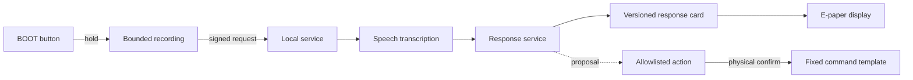

---
hide:
  - navigation
  - toc
---

<section class="ink-hero">
  

    
    
Quiet hardware. Useful answers.

    <h1>A small screen for the things worth keeping.</h1>
    
InkMate is a local-first e-paper companion for brief voice requests, useful status, and carefully approved local actions.

    

      <a class="md-button md-button--primary" href="hardware-bring-up/">Bring up the board</a>
      <a class="md-button" href="architecture/">Explore the architecture</a>
    

  

  
</section>

## Why InkMate

Most screens compete for attention. InkMate does the opposite: ask for one
thing, glance at the result, and leave it there until you need it. The e-paper
display is calm, readable, and persistent. The device is small enough to keep
on a desk, shelf, or workbench without becoming another notification source.

The board handles buttons, audio, networking, cards, and playback. A trusted
service on the local network handles speech and returns a short response. The
last useful card stays visible without continuous power.

  <article class="ink-card">01<h3>Ask</h3>
Hold BOOT, speak briefly, then release it.
</article>
  <article class="ink-card">02<h3>Keep it local</h3>
The signed request goes only to your selected local service.
</article>
  <article class="ink-card">03<h3>Read later</h3>
The answer stays on the 200 x 200 e-paper screen without continuous refresh.
</article>
  <article class="ink-card">04<h3>Stay in control</h3>
Anything that changes another application needs a clear physical confirmation.
</article>

## A companion for your own space

InkMate is useful when a small, private interaction is better than opening an
app. A few examples:

- Ask a local home assistant for the state of home controls, then confirm a
  change with the physical button when it matters.
- Keep a compact home-automation status card where it is easy to glance at.
- Use it as a quiet desk assistant for short questions, timers, and reminders.
- Dictate a note or a work item, then leave the result on screen until you are
  ready to act on it.
- Keep an organizer card for the next task, a shopping reminder, or a brief
  family message.

InkMate does not need a third-party listener or a service that monitors what you
are doing. Audio goes only to the local service you configure, and audio
retention is short by default.

## Connect what already runs on your computer

InkMate can talk to approved services that already run on the host computer.
That can be a local home-automation bridge, a personal notes tool, a task list,
or a small status service. The adapter host accepts only loopback HTTP endpoints
or fixed local commands, never an arbitrary LAN endpoint or shell string.

Each connection starts disabled. You inspect its manifest, approve its exact
fingerprint, and grant it to a specific device. Read-only requests return a card.
Anything that changes state comes back to the device for confirmation first.
The [extension guide](extensions.md) documents the current local-service
interface and approval flow, including approved desktop applications such as the
default browser and VS Code.

## Supported hardware

InkMate supports the battery-equipped, non-touch
[Waveshare ESP32-S3 1.54-inch e-paper board](https://www.aliexpress.us/item/3256810104401869.html).
The V2 board pictured here is the tested unit: ESP32-S3-PICO-1-N8R8, 8 MB flash,
and 8 MB PSRAM. V1 and V2 have explicit build profiles, but the connected board
must be inspected before flashing. Touch variants and unverified revisions are
outside the current support boundary.

  <figure class="ink-device-photo">
    
    <figcaption>V2 side controls, including BOOT and PWR.</figcaption>
  </figure>
  <figure class="ink-device-photo">
    
    <figcaption>A returned response card remains visible on the e-paper display.</figcaption>
  </figure>

The [hardware guide](hardware.md) separates printed vendor markings from values
verified on the physical board.

## What happens after you speak

```mermaid
flowchart LR
  B[BOOT button] -->|hold| R[Bounded recording]
  R -->|signed request| G[Local service]
  G --> S[Speech transcription]
  S --> L[Response service]
  L --> C[Versioned response card]
  C --> E[E-paper display]
  L -. proposal .-> A[Allowlisted action]
  A -->|physical confirm| X[Fixed command template]
```

Requests include a device ID, timestamp, body hash, and signature. Any action
is a proposal until the same device confirms it before expiry. [Read the full
architecture](architecture.md) or inspect the [protocol reference](protocol.md).

## What is inside

| Area | Responsibility | Start here |
| --- | --- | --- |
| Firmware | Board profiles, state machine, provisioning, recording and display boundaries | [Firmware guide](firmware.md) |
| Local service | Authentication, cards, speech, and safe local integrations | [Deployment guide](deployment.md) |
| Protocol | JSON Schemas and representative messages | [Protocol reference](protocol.md) |
| Hardware | Evidence ledger, pin profiles, memory limits and bring-up gates | [Hardware guide](hardware.md) |
| Tooling | Local checks via `script-helpers`; reusable GitHub workflows via `ci-helpers` | [Development guide](development.md) |

## First run

1. Clone with `--recurse-submodules` and install Docker plus ESP-IDF 6.0.2.
2. Copy `.env.example` to `.env`, generate a unique high-entropy device secret,
   and keep the gateway bound to a trusted interface.
3. Start the gateway with `docker compose up --build`.
4. Identify the actual PCB revision and memory before selecting V1 or V2.
5. Configure a private provisioning PoP, build, flash over USB, and complete the
   [hardware bring-up checklist](hardware-bring-up.md).

!!! warning "Inspect before flashing"
    Product listings are helpful when choosing a board, but they do not identify
    the revision in your hand. OTA reboot and automatic deep sleep remain off
    until USB and battery reset behavior are verified on the physical unit.

## Built to be careful

- No production credentials are included. Missing enrollment details stop setup
  rather than guessing.
- Only named, fixed command templates can run. There is no free-form shell.
- Audio and action grants are short-lived, and transcript logging is off by default.
- E-paper cards should not contain secrets because they remain visible after power loss.

[Review the threat model](security-model.md){ .md-button }
